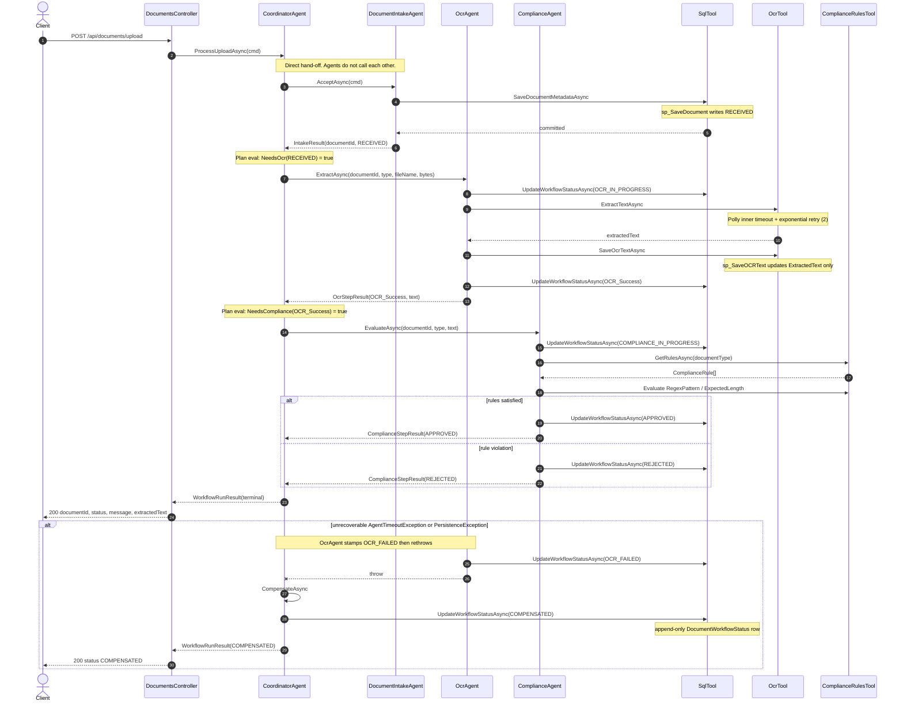
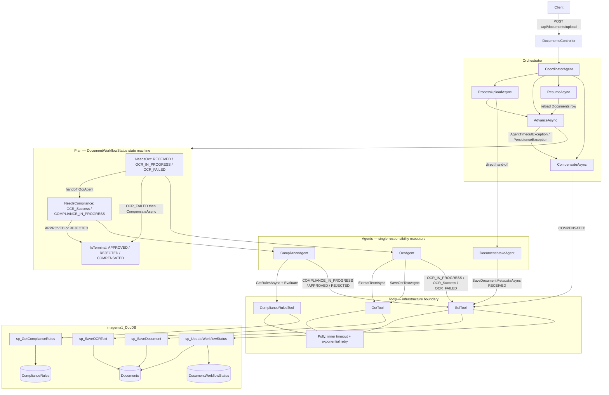

# Agentic Flow — Orchestrator, Plans, Agents, Tools

Control plane for KYC document processing. Sub-agents do not call each other and do not own the next hop. `CoordinatorAgent` is the only planner; `DocumentWorkflowStatus` is the only plan. Tools are the only components that open `SqlConnection` or run Polly.

| Layer | Owner | Responsibility |
| --- | --- | --- |
| **Orchestrator** | `CoordinatorAgent` | Workflow transitions, plan evaluation, retry *delegation* (does not retry itself), `CompensateAsync` |
| **Plans** | `NeedsOcr` / `NeedsCompliance` / `IsTerminal` | Deterministic predicates over persisted `WorkflowStatus` |
| **Agents** | `DocumentIntakeAgent`, `OcrAgent`, `ComplianceAgent` | Single-step executors; write their own status rows through tools |
| **Tools** | `SqlTool`, `OcrTool`, `ComplianceRulesTool` | Stored procedures, OCR simulation, regex/length evaluation, Polly pipelines |

---

## Orchestrator — `CoordinatorAgent`

Entry points:

| Method | Trigger | Behaviour |
| --- | --- | --- |
| `ProcessUploadAsync` | `POST /api/documents/upload` | Direct hand-off to intake, then `AdvanceAsync` from `RECEIVED` |
| `AdvanceAsync` | Internal | Evaluates the plan, invokes one agent at a time, catches unrecoverable faults |
| `ResumeAsync` | Operator / host process (not HTTP) | Reloads `Documents` + latest audit row and re-enters `AdvanceAsync` |
| `CompensateAsync` | `AgentTimeoutException`, `PersistenceException`, `ComplianceValidationException` | Appends `COMPENSATED`; does not roll back intake |

`AdvanceAsync` never inspects in-memory conversation state. After each agent returns, it re-evaluates the status that agent just committed. If OCR throws, compliance is not started.

---

## Plans — `DocumentWorkflowStatus` state machine

There is no planner artefact and no LLM. The plan is three predicates in `CoordinatorAgent`:

```
NeedsOcr(status)        = RECEIVED | OCR_IN_PROGRESS | OCR_FAILED
NeedsCompliance(status) = OCR_Success | COMPLIANCE_IN_PROGRESS
IsTerminal(status)      = APPROVED | REJECTED | COMPENSATED
```

Persisted tokens (`WorkflowStatus.ToDbValue()`):

```
RECEIVED
    → OCR_IN_PROGRESS
        → OCR_Success
            → COMPLIANCE_IN_PROGRESS
                → APPROVED
                → REJECTED
        → OCR_FAILED
            → COMPENSATED
```

`ResumeAsync` is the same graph: terminal statuses return immediately (`Workflow already completed.`); `NeedsOcr` re-runs OCR; `NeedsCompliance` skips OCR and evaluates stored `ExtractedText`.

---

## Agents — single-responsibility executors

| Agent | Contract | Writes |
| --- | --- | --- |
| `DocumentIntakeAgent` | `AcceptAsync` | Validates payload, allocates `Guid`, `SqlTool.SaveDocumentMetadataAsync` → `RECEIVED` |
| `OcrAgent` | `ExtractAsync` | `OCR_IN_PROGRESS` → `OcrTool.ExtractTextAsync` → `OcrTool.SaveOcrTextAsync` → `OCR_Success`. On timeout/persist failure: `OCR_FAILED` then rethrow |
| `ComplianceAgent` | `EvaluateAsync` | `COMPLIANCE_IN_PROGRESS` → `GetRulesAsync` → regex / `ExpectedLength` → `APPROVED` or `REJECTED` |

A “handoff” is a direct C# call after the previous step has committed its status row.

---

## Tools — infrastructure boundary

Agents never construct `SqlConnection`. Polly lives here, not in agents.

| Tool | Surface | Side effects |
| --- | --- | --- |
| `SqlTool` | `SaveDocumentMetadataAsync`, `UpdateWorkflowStatusAsync`, `GetDocumentAsync` | `sp_SaveDocument`, `sp_UpdateWorkflowStatus`, status SELECT |
| `OcrTool` | `ExtractTextAsync`, `SaveOcrTextAsync` | Inner timeout (`DocDb:OcrTimeoutSeconds`, default 5s) + 2 exponential retries; `sp_SaveOCRText` writes `ExtractedText` only |
| `ComplianceRulesTool` | `GetRulesAsync`, `Evaluate` | `sp_GetComplianceRules`; in-process regex / length; built-in PAN / Aadhaar / LOA fallback if the catalog is empty |

`OCR_Success` is stamped by `OcrAgent` via `SqlTool.UpdateWorkflowStatusAsync` after `OcrTool.SaveOcrTextAsync` succeeds. `sp_SaveOCRText` does not write an audit row.

---

## Diagram 1 — End-to-end sequence

Happy path through intake → OCR → compliance, plus the coordinator compensation branch.



OCR / SQL timeouts and transient `SqlException` values are exhausted **inside** the tool pipelines before either exception reaches the coordinator. `AdvanceAsync` also compensates `ComplianceValidationException` (invalid `RegexPattern` in a loaded rule).

---

## Diagram 2 — Component architecture and tool boundary

Separation of orchestrator, plan, agents, and tools. Arrows are in-process calls; only tools touch SQL Server.



---

## Technical walkthrough

### Orchestrator-driven execution, auditability, `ResumeAsync`

Every transition is an append to `DocumentWorkflowStatus` plus a denormalized `Documents.CurrentStatus` update. Agents do not keep a private next-step pointer. After a crash or a dropped HTTP request, the coordinator reconstructs work from SQL:

1. `ResumeAsync(documentId)` loads the row (`GetDocumentAsync`). Missing id → `DocumentNotFoundException`.
2. Rebuilds `DocumentUploadCommand` from stored `CustomerId`, `DocumentType`, `FileName`, `FileContentBase64`.
3. Calls `AdvanceAsync` with current status and any stored `ExtractedText`.

Because the plan is a function of persisted status, replay is deterministic: `RECEIVED` / `OCR_IN_PROGRESS` / `OCR_FAILED` re-enter OCR; `OCR_Success` / `COMPLIANCE_IN_PROGRESS` skip extraction; terminals no-op. The audit trail is the source of truth for “how did it get here?”; `CurrentStatus` answers “where is it now?”. That is why sub-agents must not call each other — a peer-to-peer hop would exist only in memory and could not be resumed.

`ResumeAsync` is implemented on the coordinator and is **not** mapped to an HTTP route. Invoke it from an operator process, or add a secured endpoint later.

### Tool-level Polly: resilience is not a business-agent concern

`OcrAgent` and `ComplianceAgent` do not sleep, retry, or wrap `TimeoutRejectedException`. Each tool builds a Polly v8 `ResiliencePipeline` with **timeout inside retry**, so every attempt is independently capped:

| Pipeline | Timeout | Retries | Predicate | Exhaustion |
| --- | --- | --- | --- | --- |
| `OcrTool.ExtractTextAsync` | `DocDb:OcrTimeoutSeconds` (5s) | 2, 200 ms exponential + jitter | `TimeoutRejectedException` / `TimeoutException` | `AgentTimeoutException(OcrTool)` |
| `SqlTool` / `ComplianceRulesTool` / OCR persist | `DocDb:CommandTimeoutSeconds` (15s) | 3, 250 ms exponential + jitter | transient `SqlException` (deadlock 1205, `-2`, transport / Azure throttle codes) | remaining `SqlException` → `PersistenceException` |

Transient SQL noise never reaches `AdvanceAsync`. The coordinator only sees faults that already exhausted the infrastructure policy, which is the correct trigger for compensation rather than another in-process retry of the whole pipeline.

### Compensation without distributed transactions

`CompensateAsync` is a **state stamp**, not a two-phase commit and not a SQL `ROLLBACK` of `sp_SaveDocument`.

After tool retries fail, `OcrAgent` writes `OCR_FAILED` (best-effort) and rethrows. `AdvanceAsync` then:

1. Builds a reason (`{ToolName}` timeout or `{Procedure}` failure).
2. Calls `sp_UpdateWorkflowStatus` with `COMPENSATED`.
3. Logs a warning. If that write fails, the last committed status (`OCR_FAILED` or `COMPLIANCE_IN_PROGRESS`) remains; there is no undo of the `Documents` row.

Intake metadata stays. The audit log records why processing stopped. Downstream consumers treat `COMPENSATED` as terminal; `ResumeAsync` will not continue. Consistency is “every mutation is an append-only, replayable status,” not “all of intake+OCR+compliance commit atomically.” That avoids DTC, linked-server transactions, and compensating deletes of PII that already landed.
