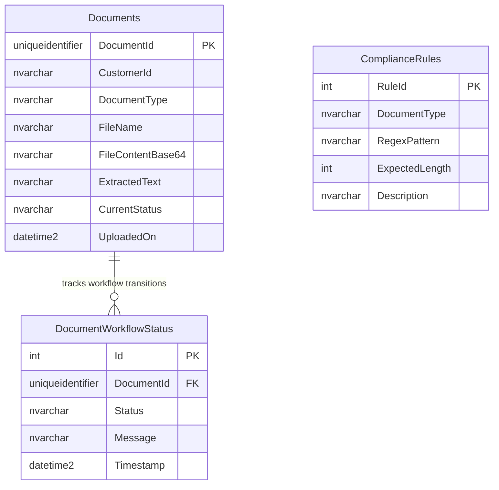

# Entity Relationship Diagram — `imagema1_DocDB`

Schema as implemented for Document Processing Orchestration. Mutations go through stored procedures; `GetDocumentAsync` is the only inline SELECT (latest audit row via `OUTER APPLY`).



`ComplianceRules` is a standalone master lookup. There is no FK to `Documents`. `ComplianceRulesTool` loads rows by `DocumentType` at evaluation time (`sp_GetComplianceRules`); matching is in-process against `ExtractedText`.

---

## Data dictionary

### Keys

| Table | Constraint | Columns | Notes |
| --- | --- | --- | --- |
| `Documents` | PK | `DocumentId` | Application-allocated `Guid`. Natural key for every subsequent call. |
| `DocumentWorkflowStatus` | PK | `Id` | Identity surrogate. Tie-breaker when two transitions share a `Timestamp`. |
| `DocumentWorkflowStatus` | FK | `DocumentId` → `Documents.DocumentId` | Enforces that an audit row cannot exist without a document. |
| `ComplianceRules` | PK | `RuleId` | Catalog identity. Not referenced by `Documents`. |

`Documents.DocumentType` and `ComplianceRules.DocumentType` share the same token set (`PAN` \| `AADHAR` \| `LOA`) but are **not** related by FK. `Documents.CurrentStatus` and `DocumentWorkflowStatus.Status` share the workflow vocabulary (`RECEIVED`, `OCR_IN_PROGRESS`, `OCR_Success`, `OCR_FAILED`, `COMPLIANCE_IN_PROGRESS`, `APPROVED`, `REJECTED`, `COMPENSATED`). `CurrentStatus` is the denormalized head of the trail; history lives only in `DocumentWorkflowStatus`.

Application-side lengths that the DB should accommodate: `CustomerId` ≤ 50; `Message` truncated to 1,000 chars before `sp_UpdateWorkflowStatus`. `FileContentBase64` and `ExtractedText` are large `nvarchar` payloads (PII).

### Append-only audit trail (`DocumentWorkflowStatus`)

Each workflow mutation **inserts** a row. Nothing in the service updates or deletes history. That is the replay log: intake, OCR start / success / fail, compliance remark, compensation reason.

Status and resume reads take the latest row:

```sql
SELECT TOP 1 Message, Timestamp
FROM DocumentWorkflowStatus
WHERE DocumentId = @DocumentId
ORDER BY Timestamp DESC, Id DESC
```

`Documents.CurrentStatus` answers “where is it now?” without scanning history. The audit table answers “how did it get there, and why?” `GET /api/documents/status/{id}` surfaces `CurrentStatus` plus that latest `Message` / `Timestamp` (`updatedUtc` falls back to `UploadedOn` if no audit row exists yet). Coordinator compensation (`COMPENSATED`) is another append, not an in-place rewrite of the failed step.

### Indexing

| Index | Purpose |
| --- | --- |
| `Documents` clustered PK on `DocumentId` | Point lookups for save, OCR persist, status, resume. |
| `DocumentWorkflowStatus` clustered PK on `Id` | Sequential inserts; cheap identity. |
| **Non-clustered `DocumentWorkflowStatus (DocumentId, Timestamp DESC)`** | Status snapshots and replay. Matches the `OUTER APPLY` / `TOP 1 … ORDER BY Timestamp DESC` access path. Prefer `Id DESC` as a third key (or `INCLUDE (Id, Message)`) so the snapshot is covering. |
| `ComplianceRules` non-clustered on `DocumentType` | `sp_GetComplianceRules` filter. Low cardinality; still cheaper than a table scan once the catalog grows. |

Do not index `FileContentBase64` / `ExtractedText`. If `CurrentStatus` is used for operational queues later, a filtered NCI on `Documents(CurrentStatus)` is the next candidate — the current API does not query by status.

### Stored procedure mappings

All writes use Dapper `CommandType.StoredProcedure`. Agents never issue `INSERT`/`UPDATE` SQL.

| Procedure | Caller | Parameters | Effect |
| --- | --- | --- | --- |
| `sp_SaveDocument` | `SqlTool.SaveDocumentMetadataAsync` | `@DocumentId`, `@CustomerId`, `@DocumentType`, `@FileName`, `@FileContentBase64`, `@Status` | Inserts the `Documents` row and stamps `CurrentStatus` (intake: `RECEIVED`). |
| `sp_UpdateWorkflowStatus` | `SqlTool.UpdateWorkflowStatusAsync` | `@DocumentId`, `@Status`, `@Message` | Appends `DocumentWorkflowStatus` and updates `Documents.CurrentStatus`. Used for every transition after intake, including compensation. |
| `sp_SaveOCRText` | `OcrTool.SaveOcrTextAsync` | `@DocumentId`, `@ExtractedText` | Updates `Documents.ExtractedText` only. Does not write an audit row; `OcrAgent` follows with `sp_UpdateWorkflowStatus` (`OCR_Success` / `OCR_FAILED`). |
| `sp_GetComplianceRules` | `ComplianceRulesTool.GetRulesAsync` | `@DocumentType` | Read of the `ComplianceRules` catalog. Empty result → in-memory PAN / Aadhaar / LOA fallback in the tool (not a DB write). |

`GetDocumentAsync` is **not** a procedure: parameterized `SELECT` from `Documents` plus the latest `DocumentWorkflowStatus` row. If DB access must stay 100% procedural, wrap that query as `sp_GetDocument`.
